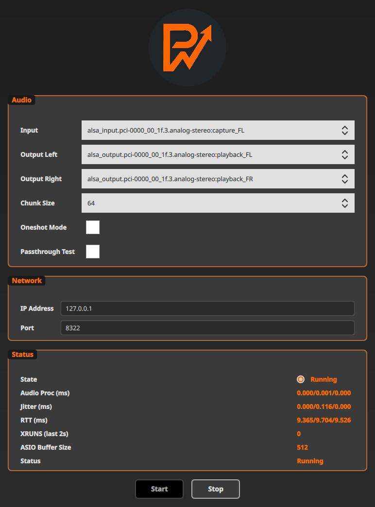

<p align="center">
  
</p>

# PWAR: PipeWire ASIO Relay

🎵 **PWAR (PipeWire ASIO Relay)** is a zero-drift, real-time audio bridge between Windows ASIO hosts and Linux PipeWire. It enables ultra-low-latency audio streaming across platforms, making it ideal for musicians, streamers, and audio professionals.

---

## 📸 Demo

<p align="center">
  
  <br>
  <em>The Qt-based GUI provides an easy way to configure and monitor audio streaming</em>
</p>

---

## 📦 Installation

### 🚀 Quick Install with Nix (Recommended)

The easiest way to try PWAR is using Nix with our pre-configured flake:

```bash
# Run GUI directly (no installation needed)
nix run github:ripxorip/PWAR

# Run CLI version
nix run github:ripxorip/PWAR#pwar-cli -- --ip YOUR_WINDOWS_IP

# Install permanently
nix profile install github:ripxorip/PWAR
```

### 🐧 Linux Package Installation

#### Debian/Ubuntu (.deb package)
Download the latest `.deb` package from the [releases page](https://github.com/ripxorip/PWAR/releases) and install:

```bash
# Download the latest release
wget https://github.com/ripxorip/PWAR/releases/latest/download/pwar_*_amd64.deb

# Install the package (recommended)
sudo apt install ./pwar_*_amd64.deb

# Alternative: use dpkg + apt for dependencies
sudo dpkg -i pwar_*_amd64.deb
sudo apt-get install -f
```

The package includes:
- 🖥️ **PWAR GUI** (`pwar_gui`) - Graphical interface for easy setup
- 💻 **PWAR CLI** (`pwar_cli`) - Command-line interface for headless setups
- 📚 **Shared library** (`libpwar.so`) for integration

#### Other Linux Distributions
Download the appropriate package for your distribution from the [releases page](https://github.com/ripxorip/PWAR/releases), or build from source (see Building section below).

### 🪟 Windows

Download the Windows ASIO driver from the [releases page](https://github.com/ripxorip/PWAR/releases):

1. **Download** `PWARASIO.dll` from the latest release
2. **Register the driver** by opening Command Prompt as Administrator and running:
   ```cmd
   regsvr32.exe "C:\path\to\PWARASIO.dll"
   ```
3. **Configure** by creating `%USERPROFILE%\pwarASIO.cfg` with your Linux server's IP:
   ```
   udp_send_ip=192.168.1.100
   ```

---

## 🚀 Quick Start

### Using the GUI (Recommended)
1. **Install PWAR** on Linux using the .deb package (see Installation section)
2. **Launch the GUI**: `pwar_gui` or find "PWAR" in your applications menu
3. **Configure settings** through the intuitive interface:
   - Set your Windows host IP address
   - Choose audio buffer size and sample rate
   - Enable/disable variable buffer sizes
4. **Start the relay** with the click of a button

### Using the Command Line
1. **Run the Linux relay:**
   ```bash
   pwar_cli --ip 192.168.1.101
   ```
   Replace `192.168.1.101` with your Windows machine's IP.

2. **Configure Windows ASIO** (see Windows installation above)

3. **Select PWAR ASIO** in your Windows audio application

---

## ✨ Features

- ⚡ **Ultra-low latency**: Real-time, zero-drift audio streaming
- 🔄 **Bidirectional audio**: Stream audio both ways between Windows and Linux
- 🎛️ **Variable buffer sizes**: Runtime adjustment of buffer size and latency

- 🖥️ **Qt-based GUI**: Intuitive graphical interface for easy configuration
- 💻 **CLI support**: Command-line interface for headless and scripted setups
- 🪟 **ASIO driver**: Native Windows ASIO driver for maximum compatibility
- 🐧 **PipeWire integration**: Seamless Linux audio system integration
- 📊 **Real-time monitoring**: Live latency and performance metrics
- 🛠️ **Easy configuration**: Simple setup with automatic network discovery

---

## ⚙️ Advanced Configuration

### Windows ASIO Configuration
Create or edit `%USERPROFILE%\pwarASIO.cfg` with the following options:

```ini
# Required: Linux server IP address
udp_send_ip=192.168.1.100
```

### Linux CLI Options
```bash
pwar_cli [OPTIONS]

Options:
  --ip IP_ADDRESS, -i IP_ADDRESS     Target Windows host IP address (default: 192.168.66.3)
  --port PORT, -p PORT               UDP port to use (default: 8321)
  --buffer_size SIZE, -b SIZE        Audio buffer size in frames (default: 64)

  --passthrough_test, -pt            Enable passthrough test mode
```

---

## 🎛️ Key Features Explained


### Variable Buffer Sizes
Allows runtime adjustment of buffer sizes to balance between latency and stability. Smaller buffers = lower latency but require more CPU and stable network.

### Real-time Monitoring
The GUI provides live feedback on:
- Current latency measurements
- Packet loss statistics
- Audio level meters
- Network performance metrics

---

## 🏗️ Building from Source

### 🪟 Windows (CMake)

#### 📦 Fetching the ASIO SDK
1. Download the [Steinberg ASIO SDK](https://www.steinberg.net/en/company/developers.html).
2. Extract the contents so that the folder structure is:
   ```
   <project-root>/third_party/asiosdk/
   ├── ASIO SDK 2.3.pdf
   ├── changes.txt
   ├── readme.txt
   ├── asio/
   ├── common/
   ├── driver/
   └── host/
   ```

#### 🛠️ Building the ASIO Driver
3. Install [CMake](https://cmake.org/download/) and a supported compiler (e.g., Visual Studio).
4. Open a terminal and run:
   ```powershell
   mkdir build
   cd build
   cmake .. -G "Visual Studio 17 2022" # or your version
   cmake --build . --config Release
   ```
5. The ASIO driver DLL will be in `build/windows/asio/PWARASIO.dll`.

### 🐧 Linux (CMake)
1. Install dependencies:
   ```bash
   # Ubuntu/Debian
   sudo apt-get install cmake build-essential libpipewire-0.3-dev qtbase5-dev qtdeclarative5-dev

   # Or use Nix (recommended)
   nix develop
   ```
2. Build using CMake:
   ```bash
   mkdir build
   cd build
   cmake ..
   make -j$(nproc)
   ```
3. The binaries will be in `build/linux/` (e.g., `pwar_cli`, `pwar_gui`, `libpwar.so`).

#### 🧪 Protocol Unit Tests
To build protocol unit tests:
```bash
cd protocol/test
mkdir build
cd build
cmake ..
make
```
Test binaries will be in `protocol/test/build/`.

---

## 🛠️ Troubleshooting

### Common Issues
- **No audio streaming**: Ensure both machines are on the same network and firewall allows UDP traffic on port 8321
- **High latency**: Try reducing buffer sizes
- **Audio dropouts**: Increase buffer size or check network stability
- **ASIO driver not found**: Make sure you've registered the DLL with `regsvr32.exe`

### Performance Tips
- Use wired network connections for best results
- Match sample rates between Windows and Linux (48kHz recommended)
- Close unnecessary applications to reduce CPU load


---

## 🗺️ Roadmap

- ✅ **Variable buffer sizes**: Runtime adjustment of buffer size and latency
- ✅ **Cross-platform GUI**: Qt-based interface for easy configuration
- ✅ **Package binaries**: .deb packages and Windows ASIO driver releases
- 🔄 **Enhanced monitoring**: More detailed performance metrics and visualization
- 🔄 **Auto-discovery**: Automatic network discovery of PWAR instances
- 🔄 **Reduce jitter for VM setups**: Explore virtio-vsock or shared memory for inter-VM communication

---

## 💖 Support the Project

PWAR is free and open source. If you find it useful, consider supporting its development:

[](https://ko-fi.com/ripxorip)
[](https://github.com/sponsors/ripxorip)

Every bit helps me keep improving PWAR — thank you! 🙏

---

## 🤝 Contributing

I have limited time to spend on this project, so contributions are very welcome! If you have improvements, bug fixes, or new features, please open a Pull Request (PR). I appreciate your help in making PWAR even better!

⭐ If you like this project, please consider giving it a star on GitHub to show your support!

---

## 📄 License
📝 GPL-3 — See [LICENSE](LICENSE)
